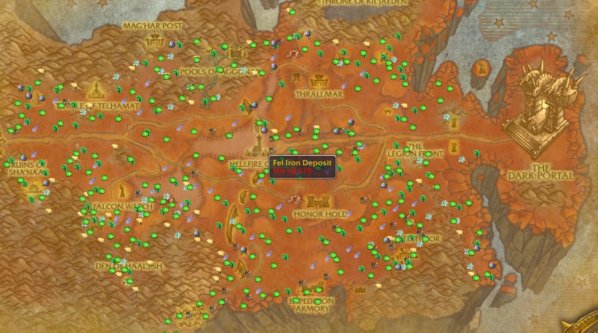

GathererLite is an addon for herbalists and miners in World of Warcraft. It's main purpose is to track the plants, deposits and treasure locations on your map.
The addon does not track like a tracking ability does, rather it "remembers" where you have found various items in the past. It does this whenever you gather (perform herbalism, mining or opening) on an item, and records the specific map location in its history.
This addon is made for World of Warcraft:Classic

### Changelog
#### 7.0.0
* Addon now uses one codebase for all classic flavors
* Updated the world map button to include filters

#### 6.0.4
* Updated the database
* Added more api function to enable other addons to use the nodes data
* Added node clusters (Nodes close to eachother will now use the same tooltip)
* More optimizations for faster loading and less memory usage when in use

#### 6.0.0
* Added the first pass off northrend nodes

#### 5.0.0
* Fixed several bugs and performance issues
* Restructured the codebase
* Updated the predefined database

### INSTALLATION
Extract the data to your "World of Warcraft/Interface/AddOns" directory so that the "GathererLite" directory is a subdirectory of the "AddOns" directory.

### EXAMPLE

### CONTRIBUTING
GatherLite is an open source project, and is built upon support of the community. 

Repository: [https://github.com/wuild/gatherlite]

Issue Tracking: [https://github.com/wuild/gatherlite/issues]
