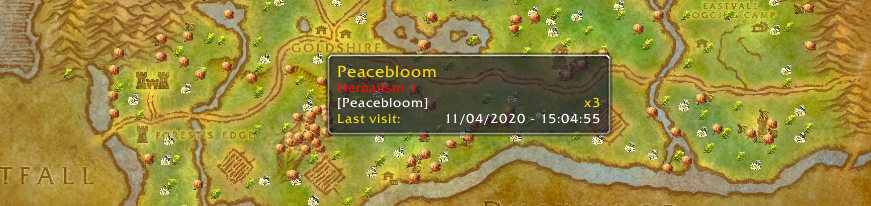

GathererLite is an addon for herbalists and miners in World of Warcraft. It's main purpose is to track the plants, deposits and treasure locations on your map.
The addon does not track like a tracking ability does, rather it "remembers" where you have found various items in the past. It does this whenever you gather (perform herbalism, mining or opening) on an item, and records the specific map location in its history.

When you view your World Map, you will also see the item locations marked on the particular map you are viewing there.

### Changelog
* 1.0.15
    * Added artifact stats to minimap tooltip
    * Now tracking fishing spots
    * If node sharing is not enabled you wont get the nodes other players share.
* 1.0.14
    * Now tracking artifacts
* 1.0.13
    * Now tracking treasure chests
* 1.0.12
    * Made the tooltip look abit nicer
    * Added icon alpha configs on minimap and worldmap
    * Added loot table configs
* 1.0.11
    * Added loot list to node tooltip
* 1.0.9
    * Changed interface version to work properly with retail wow

* 1.0.5
    * Now works with all World of Warcraft versions
    * All mining and herb nodes now work correctly
    * Added p2p functions between guilds and parties
    * Added Addon configurations in the interface settings
    * Revamped the node detection handling
* 1.0.4
    * Added minimap button for enabling / disabling node locations

### INSTALLATION
Extract the data to your "World of Warcraft/Interface/AddOns" directory so that the "GathererLite" directory is a subdirectory of the "AddOns" directory.

### USAGE
Just use the game as normal.
When you gather things, they will appear on your minimap and your main map.

### CONTRIBUTING
Gatherer is an open source project, and is built upon support of the community. 

Repository: [https://github.com/wuild/gatherlite]

Issue Tracking: [https://github.com/wuild/gatherlite/issues]