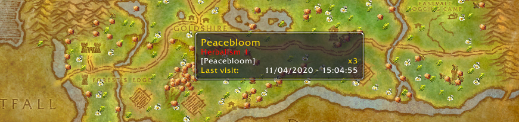

GatherLite tracks herbs, ore deposits, containers, and fishing locations in **World of Warcraft: Forever**. This branch targets Forever only (1.60.1, interface 16001).

## Installation

Place the `GatherLite` folder in your Forever client's `Interface/AddOns` directory. The folder should contain `GatherLite_Camelot.toc`. Open settings with `/gather` or `/gatherlite`.

Nearby minimap icons become hollow circles marking their known locations, leaving the center clear for the game's resource tracking dots. Adjust **Show nodes as circles within … yards** in Minimap settings to match your tracking range (0 keeps normal icons). Circles indicate possible spawn locations; GatherLite does not detect whether a resource is currently present.

## Predefined database

The single `plugins/database/data/forever.lua` file contains 26,183 supported locations. The previously retained original-world locations and Wowhead Forever imports have been consolidated; other client manifests and expansion datasets are removed.

The stored format contains only object IDs, game UI map IDs, and normalized coordinates:

```lua
addon.predefined = {
    [1731] = {                  -- Copper Vein object ID
        [1429] = {             -- Elwynn Forest UI map ID
            0.209, 0.514,       -- x, y
            0.212, 0.546,
        },
    },
}
```

Node type and icons come from the object catalog. The loader expands enabled gathering types only, shares object/map metadata between runtime nodes, and releases the consumed coordinate arrays. Empty loot tables, coins, timestamps, and world coordinates are not stored in the predefined file. Your own gathered history is saved separately, including loot and visits.

Rogue training chests are tracked under **Containers**, with individual toggles in the Tracking settings. Successful Pick Lock casts record known outdoor chest types, including empty practice chests. The database includes 262 Wowhead footlocker locations. Wowhead has no coordinates yet for Practice Lockboxes or Buccaneer's Strongboxes; those locations are recorded as you pick them in-game.

Update from Wowhead with Python 3.10+:

```sh
python tools/update_forever_wowhead.py --discover --refresh
```

Regenerate Lua from the committed import state without downloading anything:

```sh
python tools/update_forever_wowhead.py --generate-only
```

See [the importer guide](tools/wowhead/README.md) for previews, offline mode, source details, and new objects.

## Validation

For the separate Forever release branch, versioning, clean ZIP builds, and CurseForge publication, see [the release guide](RELEASE.md).

```sh
python -m unittest discover -s tools -p 'test_*.py'
lua tools/test_compat.lua
lua tools/test_database.lua
lua tools/test_tracking.lua
lua tools/test_tooltips.lua
```

Compatibility is based on the [Forever UI source, build 69913](https://github.com/Gethe/wow-ui-source/tree/70ef1b2fd78061a73f886c4a1e79dc5b5cff6d5e). In-game testing is still required: enable `/console scriptErrors 1`, reload, test `/gather`, both map buttons, gathering and interrupted casts, hiding predefined nodes, and saved history after reload.

## Contributing

[Repository](https://github.com/wuild/gatherlite) · [Issues](https://github.com/wuild/gatherlite/issues) · [Support the author](https://www.buymeacoffee.com/yuImx6KOY)
