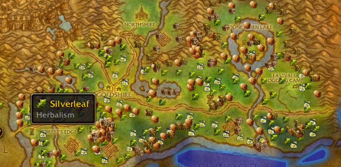

# GatherLite

Track herbs, ore, containers, and fishing locations on your world map and minimap in **WoW Forever**. Includes over **26,000 known locations** and saves your own gathering history.

GatherLite now supports Forever only. Support for older WoW clients has ended.

## Installation

Download from [CurseForge](https://www.curseforge.com/wow/addons/gatherlite/files) and place the `GatherLite` folder in `Interface/AddOns`. The folder should contain `GatherLite.toc`.

Open settings with `/gather` or `/gatherlite`.

## Using the maps

- **Left-click a GatherLite map button** to choose which gathering categories to show. Each map has its own settings.
- **Right-click a GatherLite map button** to open settings.
- **Hover a marker** for details and available gathering history.
- **Nearby minimap markers become hollow circles**, leaving room for the game's tracking dots. Adjust the distance in Minimap settings, or set it to `0` to keep normal icons.

Markers show known locations, not whether a resource is currently present. Rogue practice chests and footlockers are included under **Containers**.

## Support

[Report an issue](https://github.com/wuild/gatherlite/issues) · [Support the author](https://www.buymeacoffee.com/yuImx6KOY)

For publishing, database updates, and tests, see the [maintainer guide](tools/README.md).
